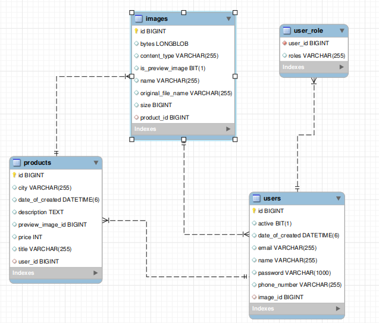
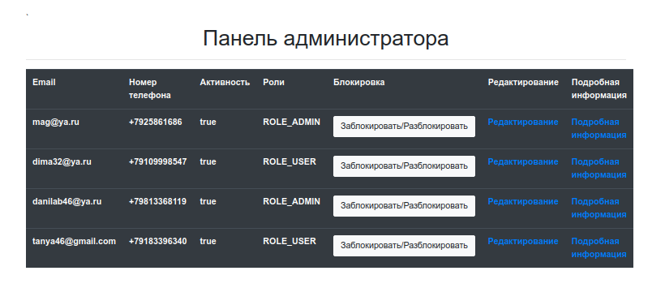

# Flea Market


Flea Market is a simple **Spring Boot** application. 
The developed application is a platform for selling goods.
This project was created **for educational purposes**.

Application runs from localhost:8080/

# Table of contents
* [Technology stack](#technology-stack)
* [Functionality](#functionality)
* [Database settings](#database-settings)
* [Demonstration of the application](#demonstration-of-the-application)
* [FAQ](#faq)

## Technology stack
Below is a set of technologies that were used in the development of the application:
* Spring: Boot, Security, Data
* MySQL
* FreeMarker 
* JavaScript
* Bootstrap
* Maven

## Functionality
The functionality of the application is described below:
* User registration
* User authorization 
* Add a new product 
* Get additional product information
* Delete a product
* Viewing the list of registered users (as the administrator)
* Block/unblock a user (as the administrator)
* Find the product by name
* Change the user role to administrator and vice versa.

## Database settings
MySQL is used as the database.
If you want to run the project locally, follow these steps:
1. Open src/main/resources/application.properties
2. Change ```spring.datasource.username``` and ```spring.datasource.password``` 
according to your MySQL installation.
3. If necessary, change the ```spring.datasource.url```.

The ER (Entity Relationship) diagram is shown below:



There are users of type user and admin.
## Demonstration of the application
To get acquainted with the goods that are sold at the Flea Market, you need to open 
the main page of the application.
The main page looks like this:


To find out detailed information about the product, you need to click on the product you like.
The photo shows detailed information about the mobile phone (iPhone 14).


If you want to view the products of a specific user, click on his link (nickname).
For example, when you click on the name (Татьяна Новикова), the next page opens.


It is also worth noting that to find a specific product, enter its name in the search bar.
For example, let's see if anyone sells Pikachu. The result is shown in the figure.


In order to add a product, you need to register. The registration form is shown in the figure below.


After you have registered, you need to log in.
I want to say that the password you specified will be encrypted, 
so it will not be so easy to pick up the key.

To log in, enter the data specified during registration.


After logging in, your personal account will be available to you.
In your personal account, you can view your contact details, as well as get acquainted with the products that 
you have put up for sale.
In order to log out of your account, you need to click on the appropriate button.
The user's personal account is shown below.


To view the products that you sell, you need to click on the "Мои товары" button.
If you want to remove the product (remove from sale), click on the "Удалить" button, and the ad will be deleted.
The page with the user's products is presented below.


If you want to add a product, click on the "Добавить новый товар" button. 
A form will appear that you need to fill out. The user is given 
the opportunity to upload up to 3 photos, but to publish an ad, it is enough 
to upload at least one photo. The form for adding the product is given below.


If you have administrator rights, the admin panel will be available to you. Here you can 
get acquainted with all the users registered in the system, as well as block/unblock a specific user, 
if necessary.



The true status in the activity column indicates that the user can log in. 
This status can be changed by clicking on the "Заблокировать" button. 
If the status is false, the user will not be able to log in.

I also want to note that to return to the main page, 
click on the inscription "Flea Market" in the header.

## FAQ
1. Packet for query is too large (2285643 > 1048576). 
You can change this value on the server by setting the 'max_allowed_packet' variable.
What can I do?
```sql
SOLUTIONS:-
You can see it's current value in mysql like this:

SHOW VARIABLES LIKE 'max_allowed_packet'

You can try to change it like this, but it's unlikely this will work on shared hosting:

SET GLOBAL max_allowed_packet=16777216;
and restart mysql service..
```
2. How do I create a user with administrator rights (using Java)?

By changing the line of code shown below, you will constantly create users with administrator rights.
```java
public boolean createUser(User user) {
        // ...   
        // Установить роль ROLE_ADMIN
        user.getRoles().add(Role.ROLE_ADMIN);
        
        // TODO
    }
```